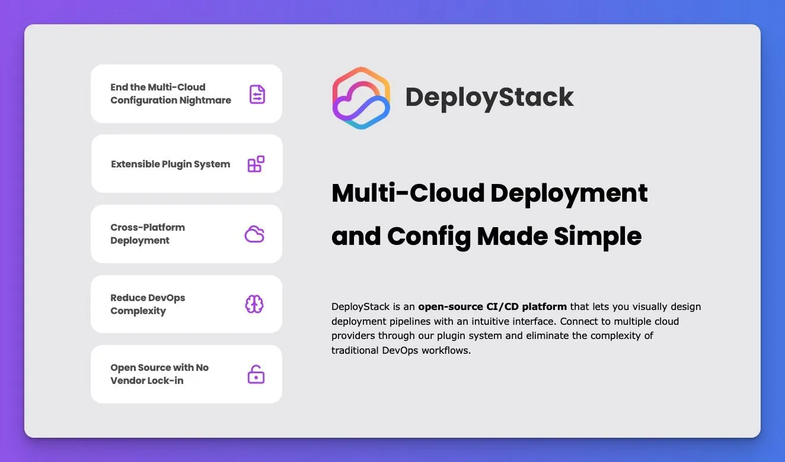

# DeployStack



<br />

DeployStack is an open-source CI/CD platform specifically built for MCP (Model Context Protocol) servers. Think of us as the infrastructure layer that makes MCP server deployment as simple as using n8n for automations - you select your MCP server, configure credentials, choose your target platform, and we handle all the complex deployment work behind the scenes.

## What Makes DeployStack Different

- **MCP-Native CI/CD**: Purpose-built for MCP server lifecycle management, not adapted from general deployment tools
- **Multi-Cloud Excellence**: Deploy MCP servers to AWS, Render.com, Fly.io, DigitalOcean, and more with one click
- **Enterprise-Ready**: Team collaboration, private catalogs, and security features for organizations
- **Community-Driven**: Open-source foundation with curated MCP server catalog
- **Developer Experience Focus**: Eliminates the technical complexity that currently limits MCP adoption

## The MCP Server Deployment Problem

MCP servers are experiencing explosive adoption, with Claude Desktop leading the way as the primary integration point for AI agents. However, deploying MCP servers presents significant challenges that DeployStack addresses:

### Current Pain Points We Solve

**1. Technical Complexity Barriers**
Getting up and running with MCP servers is a headache for developers, with basic examples requiring hundreds of lines of code and complex dependency management

**2. Security and Credential Management**
Users are asked to configure sensitive data in plaintext JSON files, and MCP currently lacks standardized authentication mechanisms for client-server interactions

**3. Production Deployment Gaps**
Most MCP servers are designed for local development, with transport protocols like stdio that won't work in production environments

**4. Multi-Tenant Architecture Challenges**
Current MCP servers are often single-user, and multi-tenancy (one MCP server serving multiple independent agents or users) is not much explored yet

**5. Fragmented Discovery**
As more MCP servers are developed, mechanisms for discovering trusted and maintained servers are needed, with broader solutions for standardization still required

## Core Features

- **One-Click MCP Deployment**: Deploy any MCP server to production instantly across multiple cloud providers
- **Secure Credential Management**: Encrypted storage and injection of API keys, OAuth tokens, and secrets
- **Team Collaboration**: Role-based access control, shared configurations, and organizational management
- **Internal MCP Catalogs**: Private, company-specific MCP server catalogs for enterprise deployments
- **Multi-Tenant MCP Servers**: Deploy scalable MCP servers that serve multiple users and agents
- **Authentication Proxy**: Built-in OAuth handling and security gateway for MCP server access
- **Community Catalog Integration**: Seamless connection to our curated MCP server ecosystem

## MCP Server Ecosystem

DeployStack integrates with the broader MCP ecosystem to provide comprehensive infrastructure:

- **[awesome-mcp-server](https://github.com/deploystackio/awesome-mcp-server)**: Community-curated catalog of production-ready MCP servers
- **[deploystack.io/mcp](https://deploystack.io/mcp)**: Public discovery portal for MCP servers with one-click deployment
- **[MCP Specification](https://modelcontextprotocol.io)**: Official protocol documentation and standards

## Getting Started

### 🚀 Quick Start with DeployStack Cloud

The fastest way to deploy MCP servers and solve the current deployment challenges:

1. **Sign up for free**: [cloud.deploystack.io](https://cloud.deploystack.io)
2. **Browse MCP servers**: Choose from our curated catalog of production-ready servers
3. **Configure securely**: Add your credentials through our encrypted management system
4. **One-click deploy**: Select your cloud provider and deploy with enterprise-grade security (security = still in progress)
5. **Connect to MCP Server**: Use generated connection details in Claude Desktop, VS Code, or other MCP-compatible tools

### 🛠️ Self-Hosted Installation

You can also run DeployStack on your own infrastructure for maximum control:

#### Prerequisites

- Node.js 18 or higher
- npm 8 or higher
- Docker

#### Installation

1. Clone the repository:

   ```bash
   git clone https://github.com/deploystackio/deploystack.git
   cd deploystack
   ```

2. Install dependencies:

   ```bash
   npm install
   ```

3. Start development servers:

  Create a `services/backend/.env` file in the root directory with the following content:

   ```env
   DEPLOYSTACK_FRONTEND_URL=http://localhost:5173
   ```

   ```bash
   # Start frontend development server
   npm run dev:frontend
   
   # In another terminal, start backend server
   npm run dev:backend
   ```

#### Deploying with Docker

Alternatively, you can deploy the pre-built Docker images for the frontend and backend services.

1. **Pull the latest images from Docker Hub:**

    ```bash
    docker pull deploystack/frontend:latest
    docker pull deploystack/backend:latest
    ```

2. **Run the Backend Service:**

    The backend requires a persistent volume for its data (like database configuration and SQLite files). The following command maps a local directory (`./services/backend/persistent_data`) to the container's data directory. It's recommended to run this command from the root of the cloned DeployStack project directory.

    ```bash
    docker run -d \
      -p 3000:3000 \
      -e DEPLOYSTACK_FRONTEND_URL="http://localhost:8080" \
      -v $(pwd)/services/backend/persistent_data:/app/persistent_data \
      deploystack/backend:latest
    ```

3. **Run the Frontend Service:**

    The frontend requires environment variables to connect to the backend and for other configurations.

    ```bash
    docker run -d -p 8080:80 \
      -e VITE_DEPLOYSTACK_BACKEND_URL="http://localhost:3000" \
      -e VITE_APP_TITLE="DeployStack Instance" \
      deploystack/frontend:latest
    ```

    **Note:**
    - Ensure the `VITE_DEPLOYSTACK_BACKEND_URL` points to where your backend service is accessible. If running both containers on the same Docker host, `http://localhost:3000` (or the host's IP/hostname if `localhost` doesn't resolve correctly from within the frontend container's network to the backend's exposed port) should work.
    - The `$(pwd)` in the backend command assumes you are in the root of the `deploystack` project directory. Adjust the path to `services/backend/persistent_data` if running from elsewhere, or use an absolute path or a Docker named volume.

#### Production Deployment

For production deployments on a VPS or remote server, update the environment variables to use your server's IP address:

**Backend:**

```bash
docker run -d \
  -p 3000:3000 \
  -e DEPLOYSTACK_FRONTEND_URL="http://YOUR_SERVER_IP:8080" \
  -v $(pwd)/services/backend/persistent_data:/app/persistent_data \
  deploystack/backend:latest
```

**Frontend:**

```bash
docker run -d -p 8080:80 \
  -e VITE_DEPLOYSTACK_BACKEND_URL="http://YOUR_SERVER_IP:3000" \
  -e VITE_APP_TITLE="DeployStack Instance" \
  deploystack/frontend:latest
```

## Project Structure

This repository uses a monorepo structure optimized for MCP server deployment:

```bash
deploystack/
├── services/
│   ├── frontend/        # Vue.js frontend application
│   ├── backend/         # Fastify backend API
│   └── shared/          # Shared MCP utilities and types
├── scripts/             # MCP deployment automation scripts
├── templates/           # Cloud provider templates for MCP servers
└── ...
```

## Contributing to the MCP Ecosystem

We welcome contributions to both the platform and the MCP server catalog:

### Contributing MCP Servers

Add your MCP server to our community catalog:

1. Fork [awesome-mcp-server](https://github.com/deploystackio/awesome-mcp-server)
2. Add your server following the [contribution guidelines](https://github.com/deploystackio/awesome-mcp-server/blob/main/CONTRIBUTING.md)
3. Submit a pull request

Your MCP server will automatically appear in the DeployStack catalog once merged, with full deployment automation.

### Contributing to the Platform

1. Fork this repository
2. Create your feature branch (`git checkout -b feature/amazing-feature`)
3. Commit your changes following our [commit guidelines](CONTRIBUTING.md#commit-message-guidelines)
4. Push to the branch (`git push origin feature/amazing-feature`)
5. Open a Pull Request

For detailed contribution guidelines, see [CONTRIBUTING.md](CONTRIBUTING.md).

## Community and Support

- **Discord**: Join our community at [discord.gg](https://discord.gg/42Ce3S7b3b)
- **GitHub Discussions**: Ask questions and share ideas about MCP server deployment
- **Documentation**: Visit [deploystack.io/docs](https://deploystack.io/docs) for comprehensive guides
- **Twitter**: Follow [@deploystack](https://twitter.com/deploystack) for MCP ecosystem updates

## Roadmap

View our detailed roadmap at [deploystack.io/roadmap](https://deploystack.io/roadmap).

## License

This project is licensed under the DeployStack License (DSL), a permissive license that allows for almost all uses except offering the software as a cloud service that competes with DeployStack's offerings. See the [LICENSE](LICENSE) file for details.

---

**Ready to solve MCP server deployment challenges?** [Get started for free →](https://cloud.deploystack.io)
