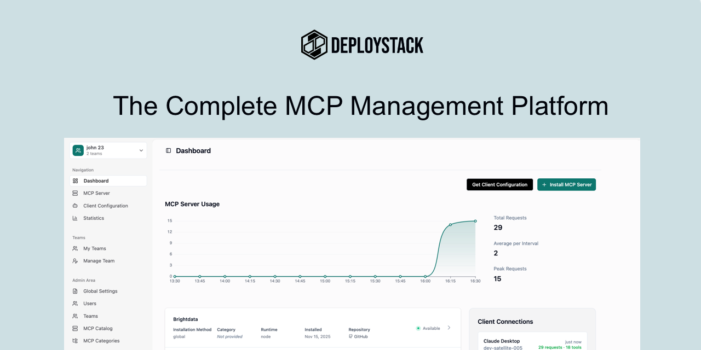

# DeployStack

<p align="center">
    <a href="https://deploystack.io">
        
    </a>
</p>

<p align="center">
    <a href="https://deploystack.io">🌐 Website</a> ·&nbsp;
    <a href="https://docs.deploystack.io/">📚 Documentation</a> ·&nbsp;
    <a href="https://deploystack.io/roadmap"> Roadmap </a> ·&nbsp;
    <a href="https://discord.gg/42Ce3S7b3b"> Discord</a>
</p>

---

DeployStack is **The First MCP-as-a-Service Platform**. We turn MCP from "complex to set up" into "just add a URL" - eliminating adoption friction for developers of all experience levels.

## The Problem

MCP is revolutionizing how AI agents use tools, but it has created a massive challenge for organizations:

- **Credential Sprawl**: Developers copy and paste sensitive API keys and tokens into insecure local configuration files, creating a huge security risk.
- **No Governance**: Who is using which tools? Which agent is accessing sensitive customer data? Without a central control plane, companies are blind.
- **Developer Friction**: Developers spend hours managing complex configurations for dozens of tools, a process that is both tedious and error-prone. Onboarding a new developer is a nightmare of configuration management.
- **Inconsistent Environments**: Every developer has a slightly different local setup, leading to "it works on my machine" problems and configuration drift.

DeployStack was built to solve these problems head-on.

## 🚀 How It Works: A Quick Tour

### Global Satellite (Zero Installation)

1. **Admin**: Creates account at `cloud.deploystack.io`, adds MCP servers (like GitHub), stores API tokens securely in DeployStack vault
2. **Developer**: Gets OAuth credentials from dashboard
3. **VS Code Setup**: Adds one URL to MCP configuration: `https://satellite.deploystack.io/mcp`
4. **Instant Access**: All team MCP tools work immediately - no installation, no local processes
5. **The Magic**:
   - VS Code calls satellite via HTTPS (like any other API)
   - Satellite receives request, checks team permissions
   - Spawns MCP server process with injected credentials
   - Returns results via standard HTTP response
   - Automatically shuts down idle processes to save resources

**Before DeployStack:**

```bash
# Manual setup nightmare
npm install -g some-mcp-cli
some-mcp configure --api-key=xxx
# Repeat for every tool, every developer
```

**After DeployStack:**

```json
{
  "mcpServers": {
    "deploystack": {
      "url": "https://satellite.deploystack.io/mcp"
    }
  }
}
```

## Architecture: Two Ways to Deploy

### Global Satellites (Managed by DeployStack)

- **Zero Installation**: Just add URL to VS Code
- **Freemium Model**: Free tier with basic MCP servers
- **Instant Access**: Pre-configured tools ready to use
- **Multi-tenant**: Resource isolation between teams
- **Example**: `https://satellite.deploystack.io/mcp`

### Team Satellites (Deploy Your Own) - (On Premise or Cloud) - (Security Ready, Deployment Tooling Coming Soon)

- **Enterprise Security**: On-premise deployment within your network
- **Internal Access**: Connect to company databases, APIs, file systems
- **Complete Isolation**: Full team separation using Linux containers
- **GitHub Actions Style**: Simple deployment with Docker
- **Example**: `https://team-satellite.yourcompany.com/mcp`

### Technical Flow

```bash
VS Code → HTTPS Request → DeployStack Satellite → MCP Server Process → External API
         ↓                 ↓                       ↓                   ↓
    (OAuth JWT)     (Team Permissions)      (Credential Injection)  (GitHub/etc)
```

**Core Components:**

- **Control Plane**: `cloud.deploystack.io` - web dashboard for teams, credentials, configurations
- **Satellites**: Managed MCP infrastructure - no local processes, just HTTPS
- **Process Manager**: On-demand MCP server spawning with X-minute idle timeout
- **Team Isolation**: Complete separation using Linux namespaces and resource limits

### Why Satellite vs Traditional Gateway?

**User Experience:**

- **Gateway**: "Install our CLI tool, configure localhost, manage processes"
- **Satellite**: "Add this URL: `https://satellite.deploystack.io/mcp`"

**Why This Matters:**

- **Adoption Friction Kills Everything**: Every MCP solution requiring CLI installation loses interested developers
- **"Another Local Proxy" Fatigue**: Market saturated with similar gateway solutions requiring installation
- **Teams Can't Scale**: Complex setups prevent MCP adoption beyond early adopters
- **Enterprise Path**: Natural progression from managed service to on-premise deployment

**Technical Benefits:**

- **No Local Dependencies**: No Node.js, npm, or port management
- **Familiar Pattern**: Works like OpenAI API, Claude API, or any SaaS
- **Auto-scaling**: Handles traffic spikes automatically
- **High Availability**: multi-region deployment
- **Instant Updates**: No user installations required for new features

## Roadmap

### **Phase 1: Foundation** (Completed)

- **[Done]** Deployed `cloud.deploystack.io` hosted version with a robust backend and frontend
- **[Done]** Implemented a secure user and team management system with roles and permissions
- **[Done]** Integrated OAuth for secure logins (e.g., GitHub)
- **[Done]** Created the initial MCP Server Catalog for tool discovery
- **[Done]** Established documentation and self-hosted Docker support

### **Phase 2: Enterprise Governance** (Completed)

- **[Done]** Auto-install MCP servers for new users with admin-controlled defaults
- **[Done]** Featured MCP servers filtering for improved tool discovery
- **[Done]** Global Event Bus System - event-driven architecture with plugin integration
- **[Done]** Three-Tier MCP Configuration Architecture - complete database schema redesign separating template, team, and user-level configurations
- **[Done]** Multi-User Configuration Management - support for multiple users within teams, each with personalized device-specific configurations
- **[Done]** Advanced MCP Argument & Environment Variable Handling - comprehensive service layer with schema validation and runtime configuration assembly

### **Phase 3: Satellite** (Current Priority)

- **[Done]** **Global Satellite Infrastructure** - managed MCP servers via HTTPS
- **[Done]** **Zero-Installation Experience** - just add URL to VS Code
- **[Done]** **OAuth Authentication** - seamless token-based auth
- **[Done]** **Satellite Pairing Security** - JWT-based token registration system for secure satellite onboarding
- **[Done]** **Public Launch** - production satellite for community use
- **[Done]** **Resource Management** - process isolation (remote MCP) and limits
- **[Done]** **GitHub README and Stars Integration** - automatic GitHub data fetching, secure storage, XSS prevention, DoS protection, and comprehensive audit logging for MCP server catalog enhancement
- **[Done]** **Background Job Queue System** - complete 4-phase custom SQLite-based job queue with worker infrastructure, admin API, frontend monitoring UI, and comprehensive documentation for long-running tasks
- **[Done]** **Cron Job Scheduling System** - recurring task scheduler using node-cron with integration into the job queue system, standard cron expression support, automatic lifecycle management, and complete separation of scheduling logic from execution for reliability and monitoring
- **[Done]** **Frontend Syntax Highlighting** - reusable CodeHighlight component with Prism.js for JSON, JavaScript, TypeScript, Bash, and YAML code blocks
- **[Done]** **Resource Management** - process isolation (stdio) and limits
- **[Done]** **MCP Registry** - integration of the official MCP Registry
- **[In Progress]** Build out Audit Logging features in the cloud UI
- **[In Progress]** Develop Analytics dashboards for tool usage and performance
- **[To Do]** Implement advanced policy controls (e.g., rate limiting, request validation)
- **[To Do]** Enhance the searchable MCP Server Catalog within the cloud UI
- **[To Do]** Deeper integration with IDEs and AI agent frameworks

### **Phase 4: Advanced Architecture** (Current Priority)

- **[Done]** **Multi-Transport Support** - SSE, Streamable HTTP, Direct HTTP protocols
- **[Done]** **Real-Time Command Orchestration** - instant status feedback
- **[Done]** **Satellite Job System** - recurring background task management with JobManager, abstract BaseJob class, automatic error handling, execution metrics tracking, and extensible architecture for health checks, cleanup tasks, and periodic maintenance operations
- **[Done]** **Satellite Backend Events System** - real-time event processing with convention-based auto-discovery handler pattern, batch processing (1-100 events), partial success handling, JSON schema validation per event type, and extensible architecture supporting MCP client connections, tool executions, server crashes, and custom event types
- **[Done]** **MCP Client Activity Tracking** - personal dashboard feature tracking active MCP clients per user across all components (backend database with mcpClientActivity table, satellite in-memory tracker with 30-second background job reporting via event system, dashboard API endpoint with dual authentication and pagination, client name detection from OAuth/headers/user-agent)
- **[Done]** **Time-Series Metrics System** - production-ready metrics infrastructure with 15-minute bucket aggregation, 3-day retention, automated cleanup
- **[To Do]** **Comprehensive Monitoring** - satellite health and usage analytics
- **[To Do]** **Enterprise Security** - audit logging and compliance features

### **Phase 5: Enterprise Team Satellites** (Future)

- **[To Do]** **Team Satellites** - customer-deployed satellites for enterprise (*security infrastructure completed, deployment tooling pending*)
- **[To Do]** **Advanced Team Isolation** - Linux namespaces and cgroups
- **[To Do]** **On-Premise Deployment** - GitHub Actions runner-style deployment  
- **[To Do]** **Enterprise Authentication** - SSO integration (SAML, OIDC)

### **Phase 6: Ecosystem Expansion** (Future)

- **[To Do]** Multi-region satellite deployment
- **[To Do]** AI agent framework integrations

## Try DeployStack

### Get Started in 3 Minutes

1. **Sign up**: Create free account at [cloud.deploystack.io](https://cloud.deploystack.io)
2. **Get credentials**: Copy OAuth client credentials from dashboard
3. **Configure VS Code**: Add satellite URL to MCP settings
4. **Start using MCP tools**: Instant access to team tools

### Links

- 🌐 **Platform**: [cloud.deploystack.io](https://cloud.deploystack.io)
- 📚 **Documentation**: [docs.deploystack.io](https://docs.deploystack.io)
- 💬 **Discord**: [Join our community](https://discord.gg/42Ce3S7b3b)

## Contributing

We're building the future of MCP adoption. Want to help?

1. Fork the repository
2. Create feature branch: `git checkout -b feature/your-enhancement`
3. Follow TypeScript and ESLint conventions
4. Add tests for new functionality
5. Submit pull request with clear description

**Areas we need help:**

- Satellite infrastructure and scaling
- MCP server integrations and testing  
- Documentation and developer experience
- Enterprise features and security

## License

Server Side Public License (SSPL) v1 - see [LICENSE](LICENSE) file for details.
