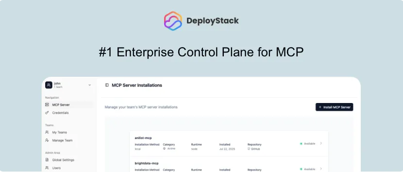

# DeployStack

<p align="center">
    <a href="https://deploystack.io">
        
    </a>
</p>

<p align="center">
    <a href="https://deploystack.io">🌐 Website</a> ·&nbsp;
    <a href="https://docs.deploystack.io/">📚 Documentation</a> ·&nbsp;
    <a href="https://deploystack.io/roadmap"> Roadmap </a> ·&nbsp;
    <a href="https://discord.gg/42Ce3S7b3b"> Discord</a>
</p>

---

DeployStack is the **Enterprise Control Plane for the Model Context Protocol (MCP) ecosystem**. It provides a secure, centralized platform to manage your company's entire MCP tool landscape, eliminating credential sprawl and enabling developers to move faster and more securely.

Think of us as the **Identity and Access Management (IAM) layer for your AI agents and tools**. We solve the critical security, governance, and developer experience challenges that arise when using MCP at scale.

## The Problem: MCP in the Enterprise is a Security Blind Spot

MCP is revolutionizing how AI agents use tools, but it has created a massive challenge for organizations:

- **Credential Sprawl**: Developers copy and paste sensitive API keys and tokens into insecure local configuration files, creating a huge security risk.
- **No Governance**: Who is using which tools? Which agent is accessing sensitive customer data? Without a central control plane, companies are blind.
- **Developer Friction**: Developers spend hours managing complex configurations for dozens of tools, a process that is both tedious and error-prone. Onboarding a new developer is a nightmare of configuration management.
- **Inconsistent Environments**: Every developer has a slightly different local setup, leading to "it works on my machine" problems and configuration drift.

DeployStack was built to solve these problems head-on.

## The Solution: A Central Control Plane with a Local Secure Gateway

DeployStack introduces a powerful Control Plane / Data Plane architecture to bring order to the chaos.

1. **`cloud.deploystack.io` (The Control Plane)**: A centralized web UI where administrators and team leads define the entire AI tooling landscape.

    - **Centralized Credential Vault**: Securely store all your MCP server credentials (API keys, tokens) in one encrypted location.
    - **Access Control Policies**: Define which teams and users have permission to access which MCP Server.
    - **MCP Catalog**: Manage a central catalog of all approved MCP servers (local, remote (coming soon), or third-party (coming soon)).
    - **Audit & Analytics**: Gain visibility into which tools are being used, by whom, and how often.

2. **The `DeployStack Gateway` (The Local Data Plane)**: A lightweight, secure agent that runs on each developer's machine.

    - **One-Time Login**: Developers log in once. The Gateway securely fetches the configurations they are authorized to use.
    - **Single Local Endpoint**: The Gateway exposes a single, stable MCP endpoint on `localhost`. Developers point all their tools (VS Code, Cursor, etc.) to this one address.
    - **On-Demand Process Spawning**: The Gateway automatically starts and stops local MCP servers (`stdio`-based) as needed, injecting credentials securely at runtime. It manages the processes so the developer doesn't have to.
    - **Zero-Trust Proxy**: All requests, whether to a local process or a remote server, are proxied through the Gateway, enforcing security policies on every call.

This architecture means developers never handle sensitive credentials, and the organization gains complete visibility and control.

## 🚀 How It Works: A Quick Tour

1. **Admin**: Logs into `cloud.deploystack.io`, creates a team, and registers an MCP server (e.g., the `github` mcp server), storing its API token securely in the DeployStack vault. They grant the "Dev Team" access to this server.
2. **Developer**: Installs the `DeployStack Gateway` and runs `deploystack-gateway login`. They are now authenticated.
3. **Configuration Sync**: The Gateway securely downloads the configuration for the "Dev Team", including the definition for the `github` mcp server (but not the raw token).
4. **Local Development**: The developer, in VS Code, makes a call to a `github` mcp via the Gateway's local endpoint (`http://localhost:9090/mcp`).
5. **The Magic**:
    - The Gateway receives the request.
    - It sees it's for `github` mcp and checks if the process is running.
    - If not, it spawns the `npx @github/mcp` process, securely injecting the API token from the cloud into the process environment.
    - It proxies the request to the newly spawned process via `stdio` and returns the result.
    - After a period of inactivity, it automatically shuts down the process to save resources.

## Getting Started

### For Administrators & Team Leads

1. **Sign up for free**: [cloud.deploystack.io](https://cloud.deploystack.io)
2. **Create a Team**: Organize your developers and resources.
3. **Register MCP Servers**: Add your company's MCP Server to the catalog and store their credentials securely.
4. **Invite Your Team**: Have your developers install the `DeployStack Gateway`.

### For Developers

1. **Install the Gateway**:

    ```bash
    npm install -g @deploystack/gateway
    ```

2. **Login**:

    ```bash
    deploystack login
    ```

3. **Configure Your Tools**: In VS Code, Cursor, or any other MCP client, set your MCP endpoint to the local Gateway address (e.g., `http://localhost:9095/mcp`).
4. **Start Building!** All the tools your team has access to are now available automatically.

## Roadmap

Our roadmap is designed to build the essential infrastructure for using MCP securely at scale, focusing on the critical pillars of security, governance, and developer experience.

### Phase 1: Foundation (Completed)

- **[Done]** Deployed `cloud.deploystack.io` hosted version with a robust backend and frontend.
- **[Done]** Implemented a secure user and team management system with roles and permissions.
- **[Done]** Integrated OAuth for secure logins (e.g., GitHub).
- **[Done]** Created the initial MCP Server Catalog for tool discovery.
- **[Done]** Established documentation and self-hosted Docker support.

### Phase 2: The Secure Gateway (Completed)

- **[Done]** Developed the `DeployStack Gateway` local application.
- **[Done]** Implemented secure authentication and configuration synchronization between the Gateway and the cloud.
- **[Done]** Built the on-demand `stdio` process spawning and management logic.
- **[Done]** Added support for multi-user teams with role-based access control.

### Phase 3: Enterprise Governance (Current Focus)

- **[Done]** Auto-install MCP servers for new users with admin-controlled defaults.
- **[Done]** Featured MCP servers filtering for improved tool discovery.
- **[Done]** Global Event Bus System (Phase 2) - event-driven architecture with plugin integration.
- **[Done]** Three-Tier MCP Configuration Architecture - complete database schema redesign separating template, team, and user-level configurations.
- **[Done]** Multi-User Configuration Management - support for multiple users within teams, each with personalized device-specific configurations.
- **[Done]** Advanced MCP Argument & Environment Variable Handling - comprehensive service layer with schema validation and runtime configuration assembly.
- **[To Do]** Build out Audit Logging features in the cloud UI.
- **[To Do]** Develop Analytics dashboards for tool usage and performance.
- **[To Do]** Add `deploystack logs` command for real-time gateway activity monitoring.
- **[To Do]** Implement advanced policy controls (e.g., rate limiting, request validation).
- **[To Do]** Add support for proxying to remote, HTTP-based MCP servers.

### Phase 4: Ecosystem & Integration

- **[To Do]** Introduce OAuth2 support for delegated authentication to backend services.
- **[To Do]** Enhance the searchable MCP Server Catalog within the cloud UI.
- **[To Do]** Deeper integration with IDEs and AI agent frameworks.

## Project Structure

This repository uses a monorepo structure with the following components:

```bash
deploystack/
├── services/
│   ├── frontend/        # Vue.js frontend application for cloud.deploystack.io
│   ├── backend/         # Fastify backend API for the cloud control plane
│   ├── gateway/         # The DeployStack Gateway
│   └── shared/          # Shared utilities and types
└── ...
```

## Contributing

We welcome contributions to help expand and improve the DeployStack platform.

1. Fork this repository.
2. Create your feature branch (`git checkout -b feature/analytics-dashboard`).
3. Commit your changes following our [commit guidelines](CONTRIBUTING.md#commit-message-guidelines).
4. Push to the branch (`git push origin feature/analytics-dashboard`).
5. Open a Pull Request.

For detailed contribution guidelines, see [CONTRIBUTING.md](CONTRIBUTING.md).

## Community and Support

- **Discord**: Join our community at [discord.gg/42Ce3S7b3b](https://discord.gg/42Ce3S7b3b) to discuss DeployStack.
- **GitHub Discussions**: Ask questions and share ideas about the Enterprise Control Plane.
- **Twitter**: Follow [@deploystack](https://twitter.com/deploystack) for updates.

## License

This project is licensed under the Server Side Public License (SSPL) v1. This allows you to use, modify, and distribute DeployStack freely, including for commercial purposes. The only restriction is that if you offer DeployStack as a managed service, you must open source your entire service infrastructure. See the [LICENSE](LICENSE) file for details.
